<p align="center">
  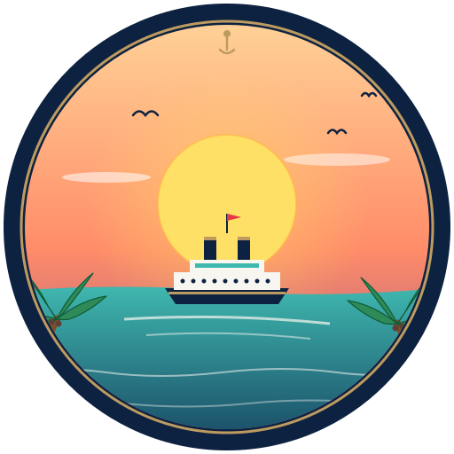
</p>

# Cruise Control

A web app for cruise enthusiasts — the people who, the minute they step off
the gangway, are already daydreaming about the next sailing.

We built Cruise Control for ourselves. On the ship we pull it up on our
phones to log the night's show, file away the name of a bartender who made
us feel like regulars, and dump the day's photos straight from the camera
roll. Between cruises we use it to hunt for the next one — pick a port on
the world map, set the date window, and fire the search out to Google,
Cruise Critic, and Vacations To Go in one click.

It's a Flask + PostgreSQL + jQuery app. This is the **public** release —
personal data has been stripped and the seed file ships two demo passengers
("Traveller 1" and "Traveller 2") plus a small handful of sample trips so
you can see it all working out of the box.

## What it does

### Trips — every sailing you've taken, booked, or have your eye on

The Trips tab is home base. Every cruise you've logged shows up on the
world map with its route drawn between ports, and in a sortable,
exportable table below.

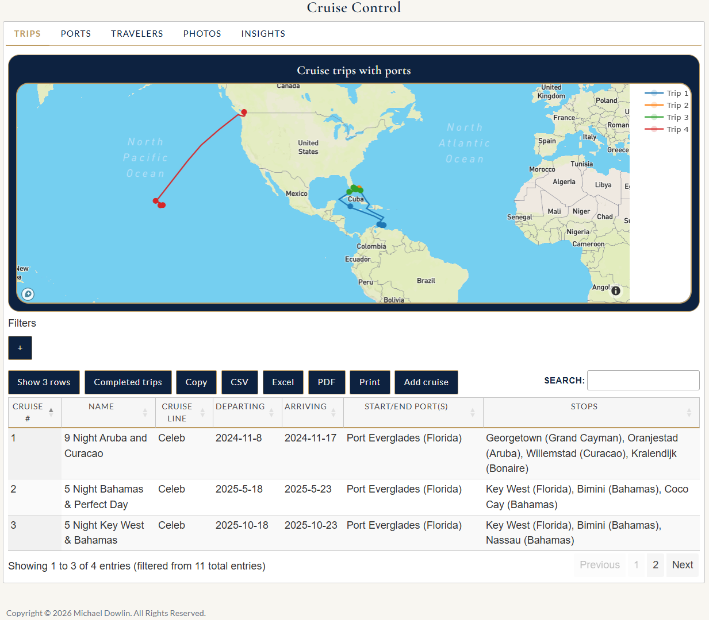

Zoom in and the sea-routes resolve into the actual paths between stops —
fun to look back on after a Pacific Northwest run.

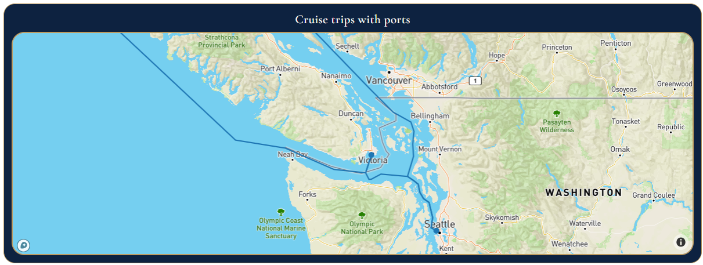

### Trip detail — everything about one cruise, in one dialog

Click any trip and the Edit dialog opens with tabs for everything we've
ever wanted to remember about a sailing: details, itinerary, cost, staff,
events, photos, and music.

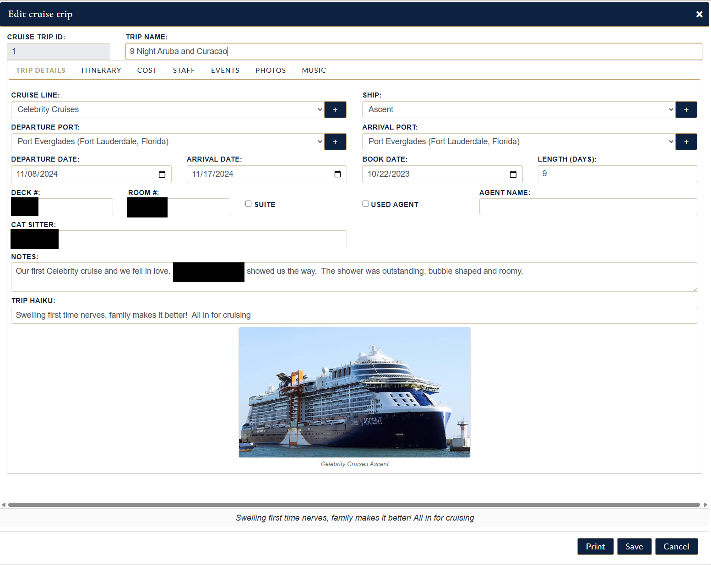

**Itinerary** keeps the day-by-day port list with space for our own
comments ("Beautiful water, lots of snorkelers", "Fantastic, want to go
back!"). Useful when a friend asks "was Curaçao worth it?"

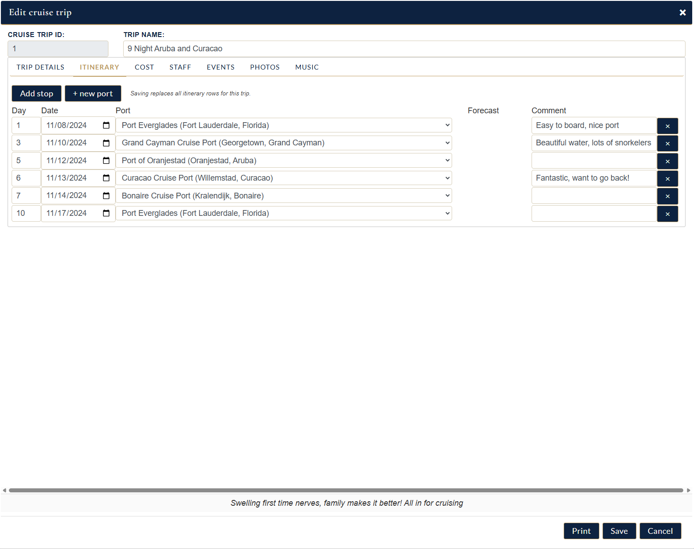

**Cost** tracks trip price, airfare, hotel, cat-sitter — even computes
cost-per-day so we can compare value across cruise lines.

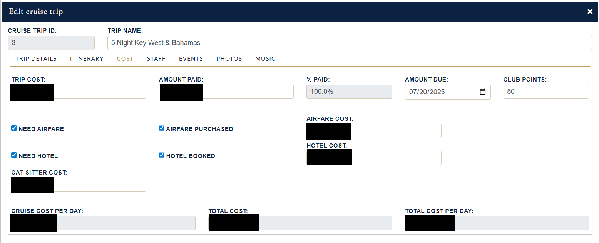

**Staff** is one of the features we lean on most. On board, when a server
or bartender or butler goes out of their way for us, we whip out the phone
and add their name right there at the table. By the end of the cruise the
list practically writes the post-cruise survey for us — and makes filling
out tip envelopes on the last night a five-minute job instead of a
"who-was-that-amazing-guy-at-the-Sunset-Bar" memory test.

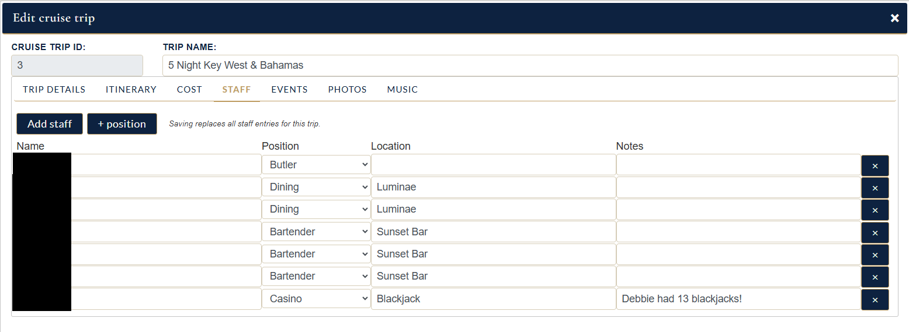

**Events** is the on-ship journal. Showtimes, excursions, the casino night
someone in the family won the blackjack tournament, the couples massage
that was so good we want to repeat it in Alaska. Every event has a date,
time, location, and notes — and every saved event automatically lights up
on the Travelers tab calendar (see below).

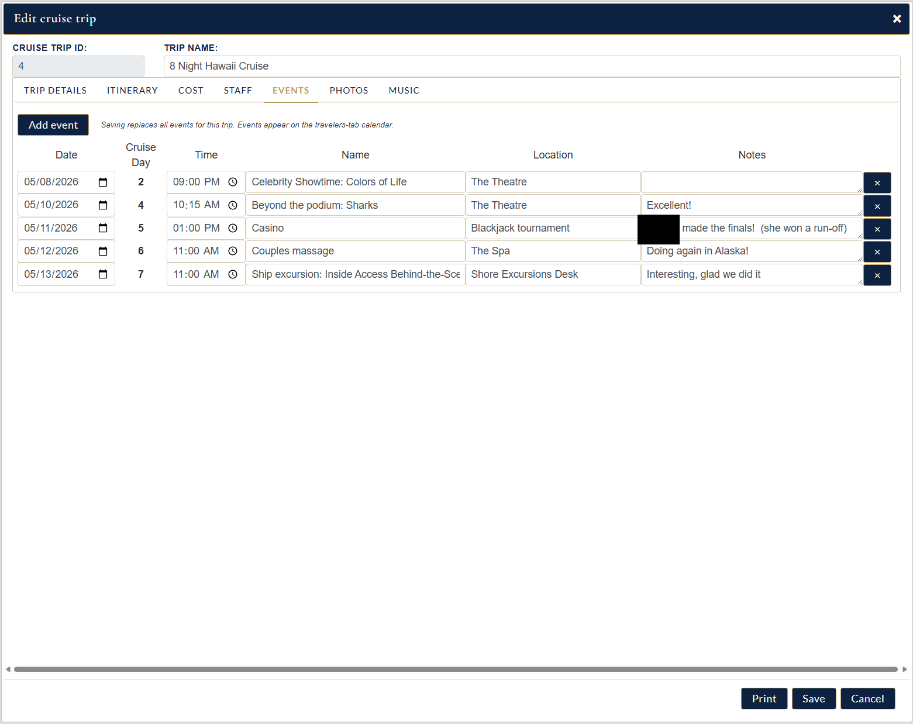

**Photos** is just drag, drop, done — straight from the phone's camera
roll while we're still at the port. Each photo can have a caption, and the
whole album lives with the trip forever.

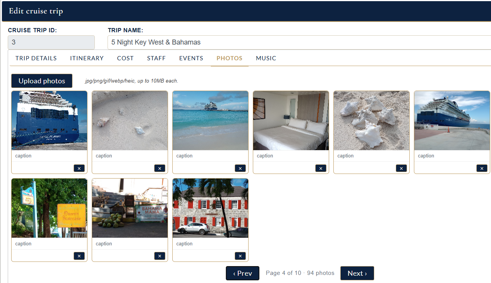

**Music** lets us paste an Apple Music playlist URL — the trip's
soundtrack. Open the trip a year later, hit play, and you're right back on
the lido deck at sunset.

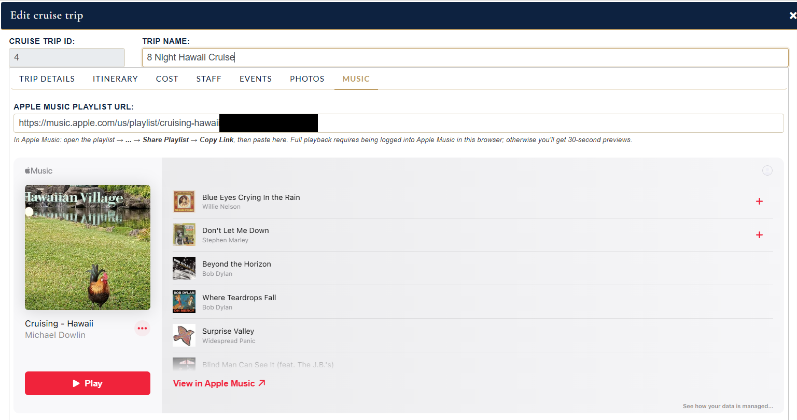

And there's a **Print** view that pulls everything — itinerary, events,
cabin & booking info — into a single clean page for the binder or to email
to the travel agent.

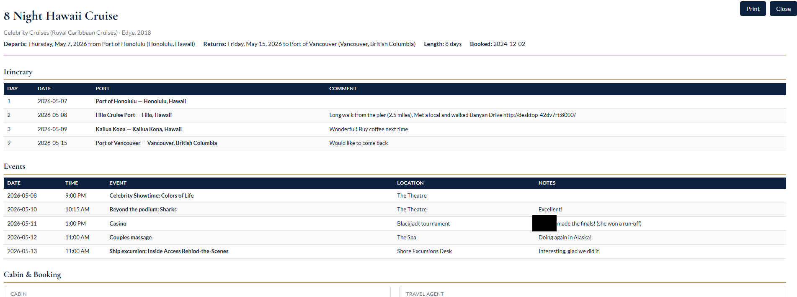

### Ports — the daydreaming tab

The Ports tab is what we open between cruises. It's a world map of every
port in the database, color-coded by what we've **visited**, what we've
**booked**, and what we **want to go** to next.

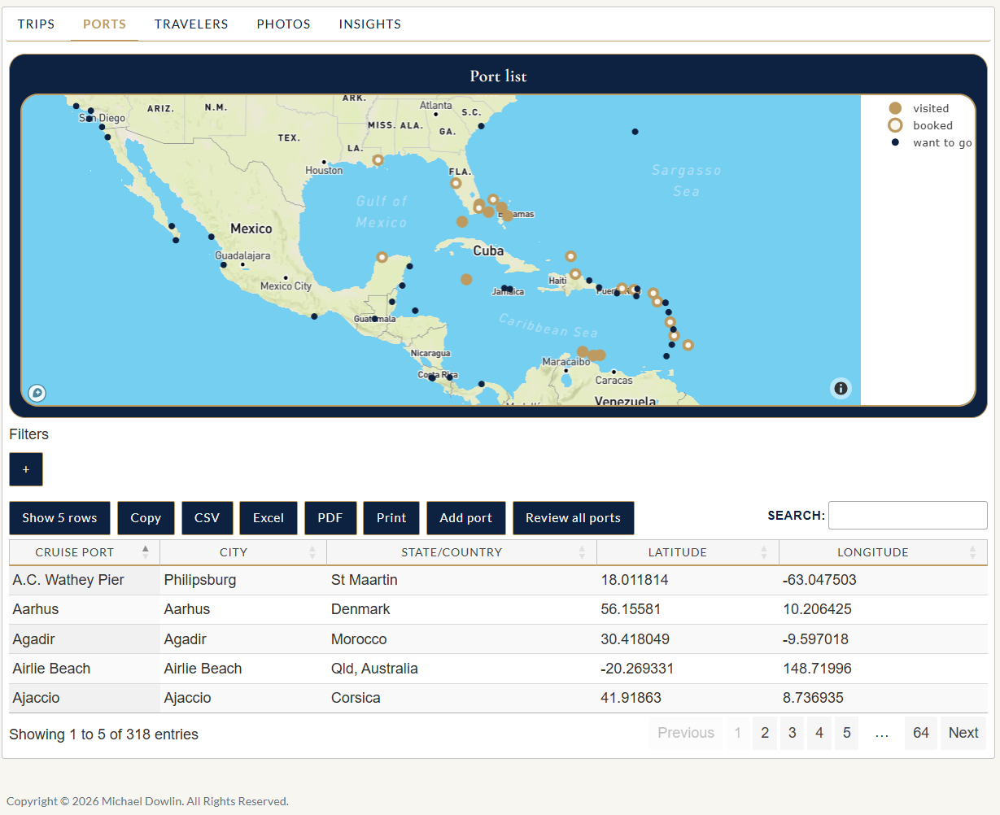

Click a port and you get its details and a precise map pin…

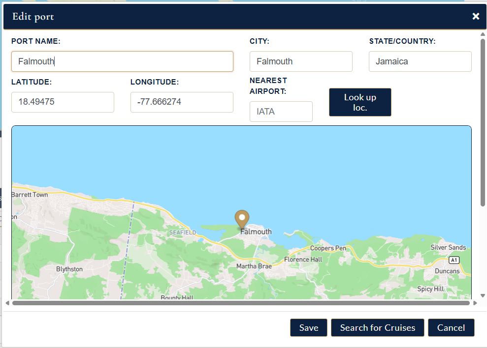

…then hit **Search for Cruises** and the app builds a cruise-shaped query
(port name + date window + optional cruise line, length, or keyword) and
fires it out to your search engine of choice — Google, Cruise Critic, or
Vacations To Go — in a new tab. No more pecking out "Falmouth cruise 2026
2027" by hand on a phone keyboard.

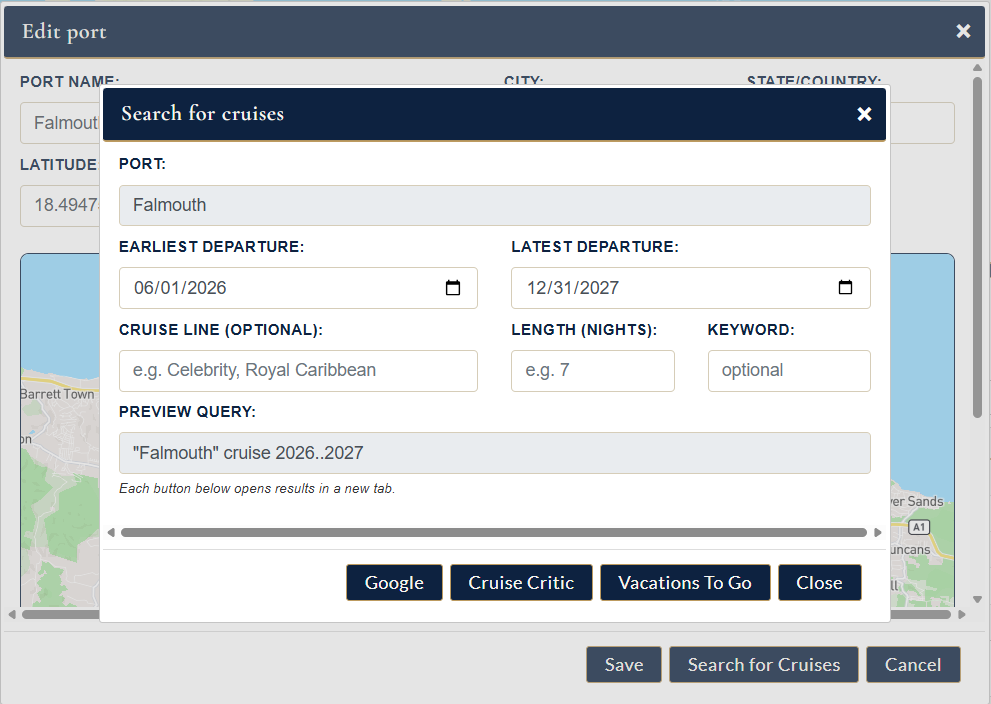

### Travelers — the family calendar

The Travelers tab is a FullCalendar view of every cruise and every event
across every traveler. Cruise spans show as banners, ports appear under the
right dates, and every individual event (showtime, excursion, spa
appointment) shows up where it belongs.

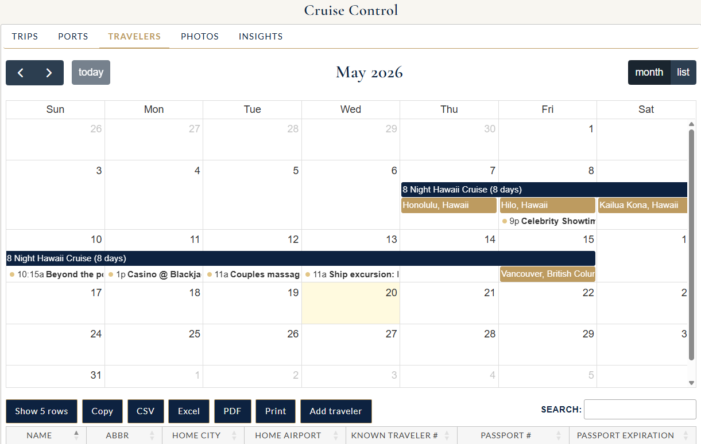

Click an event and you get the details — with a one-click jump back to the
trip it belongs to.

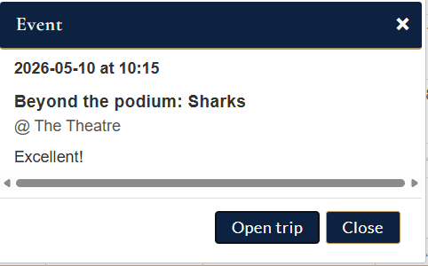

### Insights — the bragging tab

The Insights tab summarizes the whole cruising life: cruises taken, days
at sea, distinct ports, distinct ships, and a running count of the
exceptional staff we've recorded. (The full version also has spending
trend charts, club-race standings, and the clickable cruise-route world
map.)

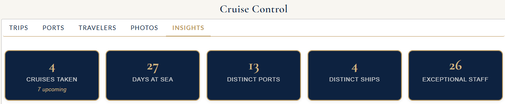

## Stack

- **Backend:** Python 3 + Flask + waitress (production WSGI), psycopg2.
- **Database:** PostgreSQL 12+.
- **Frontend:** jQuery UI + DataTables + Plotly + FullCalendar.
- **Maps:** Mapbox (token required) for the cruise-route world map and the
  port-geocoding helper script.

## Setup

### 1. Install PostgreSQL and create the database

```sh
createdb cruise_control
psql -d cruise_control -f sql/schema.sql
psql -d cruise_control -f sql/seed.sql
```

### 2. Install Python dependencies

```sh
pip install flask flask-cors psycopg2 pandas waitress werkzeug requests beautifulsoup4 airportsdata openpyxl
```

### 3. Environment variables

| Variable             | Required | Purpose                                                   |
|----------------------|----------|-----------------------------------------------------------|
| `keysql`             | yes      | PostgreSQL password for the `postgres` user.              |
| `MAPBOX_TOKEN`       | no       | Mapbox public token; needed for the cruise-route map.     |
| `CRUISE_SECRET_KEY`  | no       | Flask session secret. Auto-generated to `.flask_secret` if unset. |
| `CRUISE_HOST`        | no       | Bind address (default `0.0.0.0`).                         |
| `CRUISE_PORT`        | no       | Bind port (default `8000`).                               |

### 4. Set a password for the demo users

The seed file leaves `login_password` NULL. Set one with:

```sh
python set_password.py traveller1
python set_password.py traveller2
```

### 5. Run the server

```sh
python serve.py
```

Then browse to `http://localhost:8000/`.

## Repo layout

```
app.py                    # Flask app — all routes + queries live here
serve.py                  # waitress launcher
set_password.py           # helper to hash + store a passenger login password
sql/
  schema.sql              # full DDL (tables, sequences, constraints)
  seed.sql                # reference data + 2 demo passengers + sample trips
  cruise_trip_*.sql       # per-table schema fragments (subset of schema.sql,
                          # kept for documentation)
scripts/
  import_celebrity_ports.py   # scrape Celebrity's ports page, insert any new
  fill_port_geo.py            # geocode ports via Mapbox, pick nearest airport
  backup_cruise_control.ps1   # nightly pg_dump backup, Windows Task Scheduler
data/
  Cruise_Control_Port_lat_long.xlsx
  GUID-Sorted-By-Latitude-Longitude-Type-Name.csv   # geo reference data
static/                   # css, js, images
templates/                # Jinja2 templates (index.html, login.html, ...)
screenshots/              # the images used in this README
```

## Notes

- Trip photos are uploaded to `static/uploads/trip_<id>/` at runtime; this
  directory is `.gitignore`d.
- Backup dumps written by `scripts/backup_cruise_control.ps1` are written
  to a directory **outside** the repo and are not committed.
